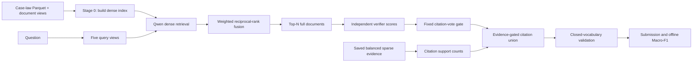
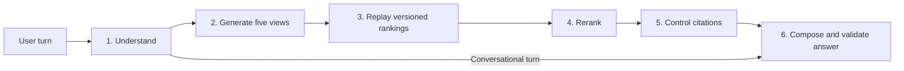

# Architecture

BetterCallAgent contains two related but separate workflows. Shared primitives live in
`src/bettercallagent`; neither workflow imports the other.

## Offline paper pipeline

Stage 0 builds the versioned retrieval index. The seven experiment modules then
expose each transformation as a small, testable Python stage. `offline.run` handles
configuration, integrity checks,
stage ordering, and run provenance.

The support method does not replace dense candidates with sparse documents. It adds a
valid citation when that citation occurs in at least two of the balanced top-five
saved sparse evidence hits. The sparse artifact is an input to the experiment; this
release does not contain the system that originally created it.

## Online application

The online service exposes observable stage inputs and outputs as Server-Sent Events.
It does not expose hidden chain-of-thought. Gold labels never enter this workflow.

Both online modes are explicit:

- `fixture` consumes invented bundled records and makes no model request;
- `live` uses a configured model endpoint but still consumes versioned, artifact-backed
  rankings for curated questions.

Stage 2 must regenerate all five stored retrieval views byte-for-byte before stage 3
can replay a ranking. A mismatched live model therefore fails instead of being
presented as the cause of unrelated evidence.

## Shared core

The workflows share:

- typed query, candidate, score, and citation records;
- the exact five-view query transformation;
- weighted reciprocal-rank fusion;
- exact citation extraction and closed-vocabulary validation;
- the fixed-vote citation policy and sparse-support aggregation;
- offline evaluation formulas; and
- an explicit OpenAI-compatible provider boundary.

Configuration loading, file access, and network access stay at application
boundaries. Importing the shared package performs no I/O.
